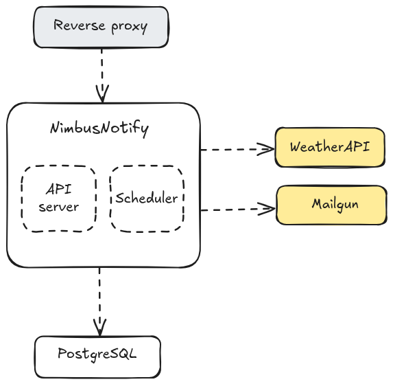
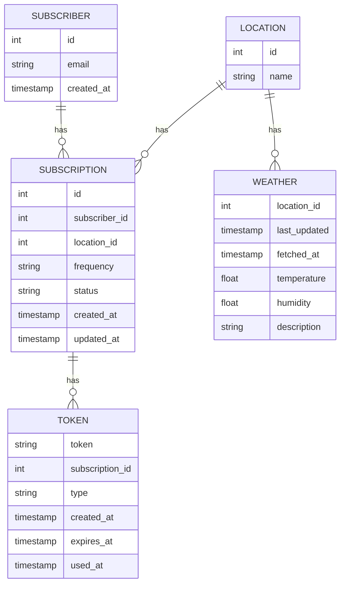
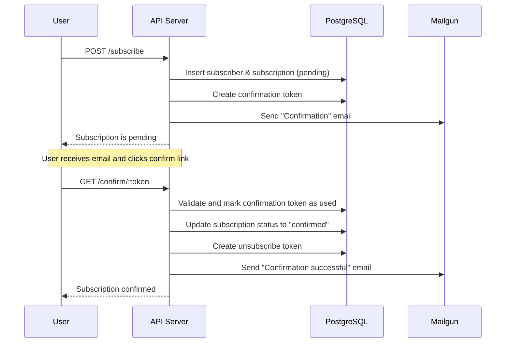
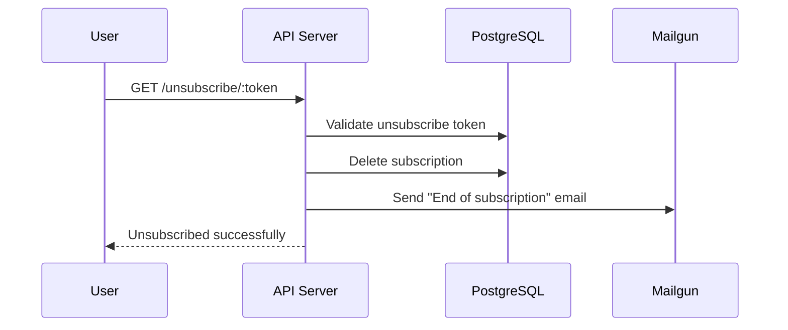

# NimbusNotify

## 1. Вимоги

### Функціональні

- Користувач може підписатись на оновлення погоди для конкретного міста з певною періодичністю
- Користувач повинен підтвердити підписку та мати змогу відписатись
- Користувач має отримувати регулярні оновлення погоди по кожній підписці
- Дані про погоду отримуємо з WeatherAPI.com

### Нефункціональні

- Система повинна бути доступною 99% часу
- Має витримувати 10_000 тис. активних користувачів
- Листи мають відправлятись із затримкою менше ніж 1 год.
- Система має валідувати дані користувача
- Дані мають зберігатись без спотворень, без часткового збереження

### Обмеження

- Бюджет: мінімальна інфраструктура

## 2. Архітектура

## 3. Оцінка навантаження

### Припущення

- 10_000 активних підписок
- 80% користувачів отримують щоденні оновлення (8_000), 20% — щогодинні (2_000)
- Пік надсилання листів: 09:00–10:00 UTC
- 1_000 унікальних міст
- Середній розмір листа: ~2 КБ

### Оціночне навантаження

| Операція              | Частота (у пік)                | Коментарі                                  |
|-----------------------|--------------------------------|--------------------------------------------|
| Запити на підписку    | 50/хв (~0.83/с)                | У періоди зростання кількості користувачів |
| Надсилання email      | 10_000/год  (~2.8/с)           | Масова розсилка в межах однієї години      |
| Запити до Weather API | 1_000/год  (~0.28/с)           | Для кожного унікального міста за годину    |
| Записи в БД           | (1_000 + 10_000)/год  (~3.1/с) | Оновлення погоди, статуси відправки        |

### Коментарі
- потрібно реалізувати batch-відправку листів
- необхідно коректно налаштувати пули з'єднань до БД та HTTP з'єднань

## 4. Структура БД

## 5. Sequence Diagrams

### 5.1 Підписка на оновлення погоди

### 5.2 Відписка від оновлення
